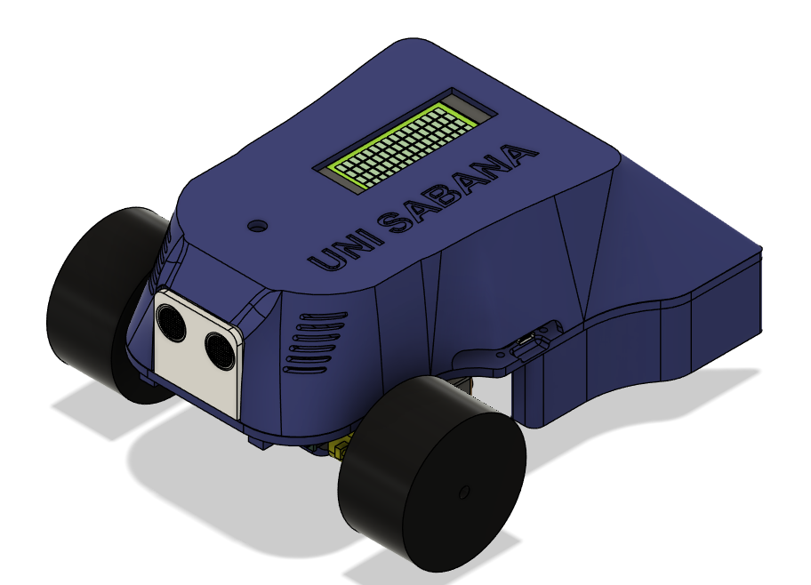
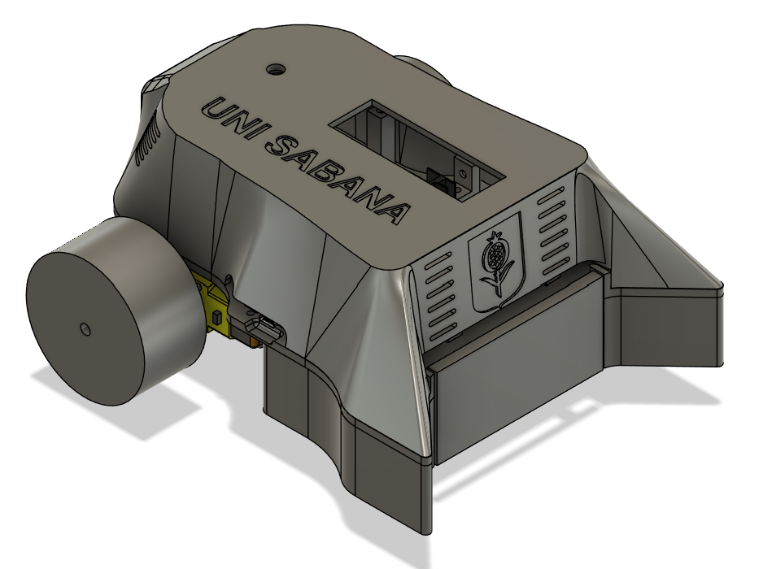
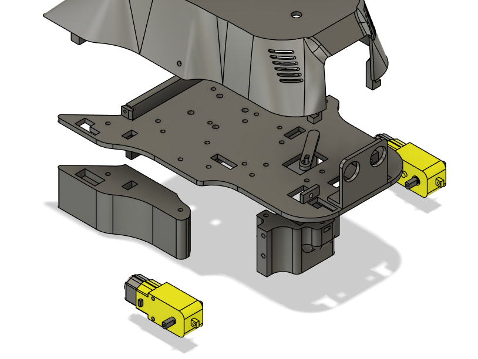
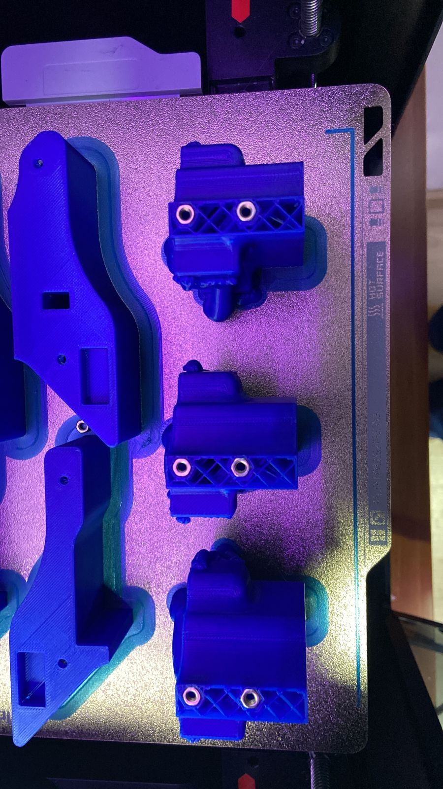
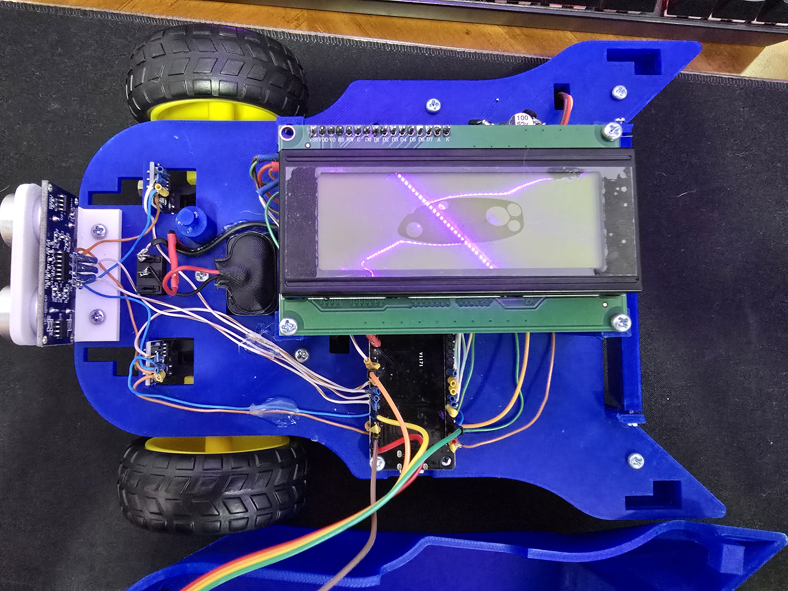
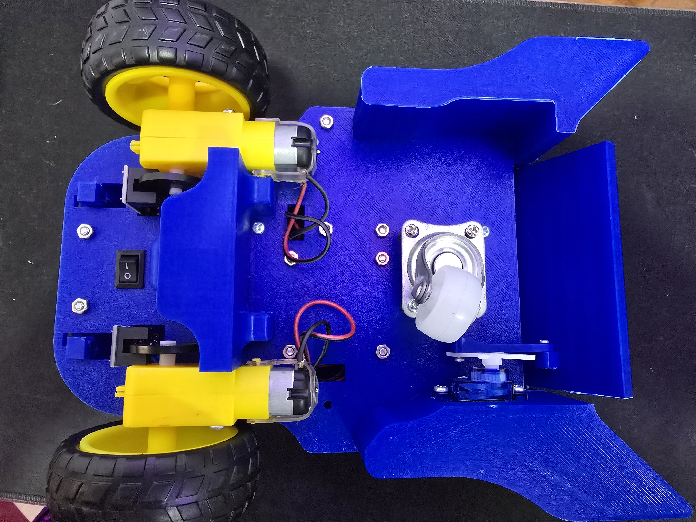
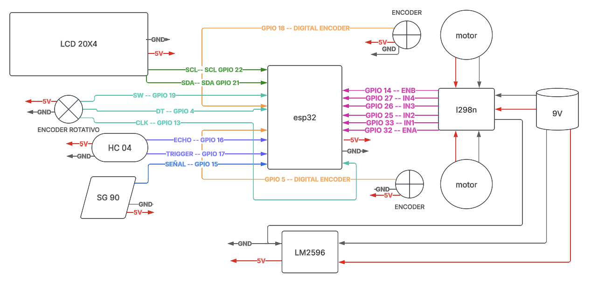

# Proyecto carro multifuncional

## Descripción del Proyecto

Este proyecto se centra en el desarrollo de un carro multifuncional controlado por una placa ESP32, pensado especialmente para talleres de “Ingeniero Mecánico por un Día” y para las actividades de Open Campus de la Universidad de La Sabana. El principal objetivo es brindar a los participantes una experiencia integral que abarque conceptos de mecánica, electrónica y programación, permitiéndoles interactuar de manera práctica y didáctica con la tecnología.

Para alcanzar este objetivo, se llevó a cabo un proceso completo que inició con el diseño y modelado CAD, donde se definieron las piezas y la estructura del carro. A partir de esos modelos, se procedió a la manufactura y fabricación de los componentes, empleando herramientas como impresión 3D y métodos de corte para obtener piezas precisas y de alta calidad. Posteriormente, se realizó el ensamble mecánico y se efectuó un cableado ordenado, lo que permitió integrar adecuadamente los módulos electrónicos y garantizar una fácil manipulación, mantenimiento y actualización del sistema.

En el aspecto de programación, la placa ESP32 se configuró para gestionar la locomoción, la lectura de sensores y la comunicación inalámbrica, ya sea vía Wi-Fi o Bluetooth. Esto habilita múltiples posibilidades de interacción y control, incluyendo el manejo remoto y la obtención de datos en tiempo real. Finalmente, se efectuaron pruebas funcionales y se perfeccionaron detalles para asegurar que el carro operara de forma estable, confiable y segura, cumpliendo así las exigencias de los talleres educativos.

Gracias a su diseño modular y la versatilidad de la ESP32, el carro multifuncional se presenta como una herramienta ideal para impartir conocimiento de manera dinámica y entretenida. De esta forma, los usuarios pueden explorar desde conceptos básicos de control de motores y programación hasta desarrollar proyectos más complejos de robótica y domótica, enriqueciendo sustancialmente su aprendizaje en cada sesión práctica.

## Contenidos

- [Modelo 3D](#modelo-3d)
- [Ensamble](#ensamble)
- [Electrónica](#electrónica)
- [APP](#APP)
- [Funciones](#funciones)
- [Reconocimientos](#reconocimientos)

## Modelo 3D

El modelo 3D fue creado utilizando Fusion 360, un software avanzado de diseño y modelado paramétrico. El diseño se enfocó en facilitar la impresión 3D, teniendo en cuenta aspectos como la disposición de soportes y la optimización del volumen de material, la ubicación de tuercas y tornillos. De esta forma, se logra un ensamble final resistente y, a la vez, ligero.

En este repositorio encontrarás el archivo fuente de Fusion 360, ubicado en la carpeta correspondiente a los modelos 3D. Puedes descargarlo y modificarlo según tus necesidades, ya sea para personalizar las dimensiones o añadir nuevas características al carro multifuncional.

### Imágenes del Modelo 3D

* Modelo 3D del carro.*

* Modelo 3D del carro.*

  
*Despiece del carro.*

## Ensamble

Un punto clave en el proceso de ensamblaje son las **tuercas internas**, las cuales se incorporan directamente en las piezas impresas en 3D. En el proyecto de **Bambu Lab**, se automatizó la pausa de la impresora al llegar a la capa correspondiente, lo que facilita la inserción exacta de las tuercas antes de continuar con la siguiente capa de impresión. De esta manera, las piezas quedan listas para su ensamble sin necesidad de adhesivos adicionales o perforaciones posteriores, aumentando la solidez y la precisión del montaje.

A continuación, se muestra la impresion del carro, donde se pueden apreciar las cavidades destinadas a estas tuercas:

  
*Impresion 3D del carro.*

Una vez finalizada la impresión de todas las partes, se realiza el **ensamble mecánico**, encajando las piezas y fijándolas con tornillos y tuercas en los puntos de unión. Este proceso garantiza una estructura estable que mantiene la alineación correcta de cada componente, lo que resulta especialmente importante para la integración de motores, sensores y demás elementos electrónicos.

  
*Ensamble del carro.*

  
*vista inferior del carro.*

## Electrónica

### Componentes Principales

- **ESP32**  
  Microcontrolador principal con conectividad Wi-Fi y Bluetooth.

- **Driver L298N**  
  Controla los motores de corriente continua.

- **Motores DC con encoders**  
  Proporcionan tracción y permiten medir velocidad y posición.

- **Sensor ultrasónico (HC-SR04)**  
  Detecta la distancia a obstáculos.

- **Regulador LM2596**  
  Reduce el voltaje de la fuente de 9V a 5V.

- **Pantalla LCD 20x4 (I2C)**  
  Muestra información en tiempo real.

- **Servo SG90**  
  Permite movimientos de giro.

- **Encoder rotatorio**  
  Se utiliza para interacciones manuales (navegación por menús, ajustes).

- **Fuente de alimentación (9V)**  
  Suministra la energía necesaria para todo el sistema.

Los elementos se conectan de forma que la **ESP32** coordine las señales de control y lectura (motores, sensores, pantalla, etc.), mientras que el **regulador LM2596** provee un voltaje estable de 5V. El **driver L298N** gestiona la potencia suministrada a los motores, y el resto de los componentes se integra para permitir funciones de monitoreo y operación del carro.

El diagrama completo con las conexiones se encuentra en el archivo **plano electrico.pdf**, disponible en este repositorio.

*Plano electrico del carro.*

## APP

La aplicación mostrada en la imagen fue **desarrollada desde cero en Android Studio** y representa tan solo **una de las múltiples funciones** que puede ofrecer el sistema. Su principal objetivo es proporcionar una **interfaz de control remoto** para el carro multifuncional, posibilitando acciones como:

1. **Conexión al Carro**  
   A través del botón “Buscar”, la aplicación explora dispositivos cercanos (vía Bluetooth) y muestra el nombre o la dirección MAC del carro. Al seleccionar la opción correspondiente, el usuario puede emparejarse con el carro para enviar y recibir datos en tiempo real.

2. **Control de Movimiento**  
   El panel central, con sus flechas y el botón circular, permite conducir el carro en distintas direcciones (adelante, atrás, izquierda, derecha), así como detenerlo o ajustar la velocidad si se integra esa funcionalidad en la programación del ESP32.

3. **Inicio y Detención**  
   El botón “Iniciar” habilita el control activo sobre el carro. Si se requiere, puede añadirse un botón o comando de “Detener” que corte toda comunicación de movimiento y deje el carro en reposo seguro.

4. **Envío de Mensajes a la Pantalla LCD**  
   Además de controlar el movimiento, la aplicación es capaz de **enviar texto** al **display LCD 20x4** instalado en el carro, lo que permite mostrar mensajes personalizados, instrucciones o cualquier otra información relevante para el usuario.

5. **Identidad y Contexto**  
   Se han incluido los logotipos de la **Universidad de La Sabana** y de **Open Campus** para destacar la finalidad educativa y el origen del proyecto. Este diseño busca que cualquier persona, incluso sin conocimientos avanzados de electrónica o programación, pueda interactuar de forma ágil y amigable con el dispositivo.

Al estar construida en **Android Studio**, la aplicación se puede **ampliar o personalizar** fácilmente para futuras funciones, tales como la monitorización de datos de sensores, la captura de imágenes o la integración de rutinas de control autónomo. De este modo, el sistema completo (carro + app) sirve como plataforma de aprendizaje y experimentación, ideal para talleres y demostraciones académicas.  

*Interfaz de la app.*

## Reconocimientos

Este proyecto no hubiera sido posible sin el esfuerzo y la dedicación de los siguientes miembros del grupo ASME:

- Juan Sebastián Ulloa Mejía
- Jorge Alberto Castellanos Rivillas
- Juan David Hoyos Bernate
